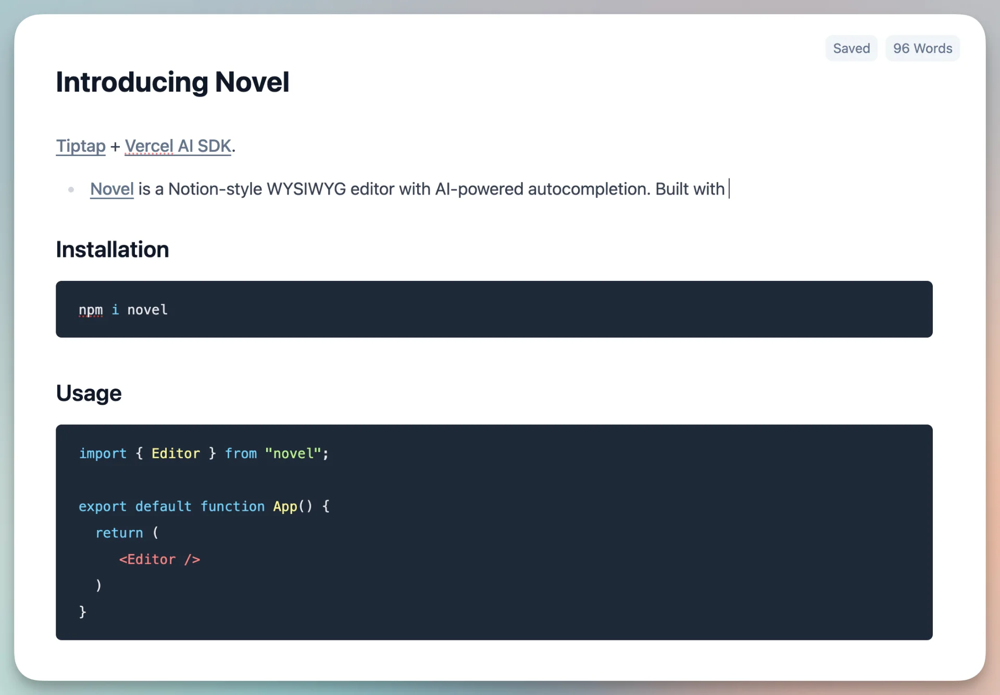
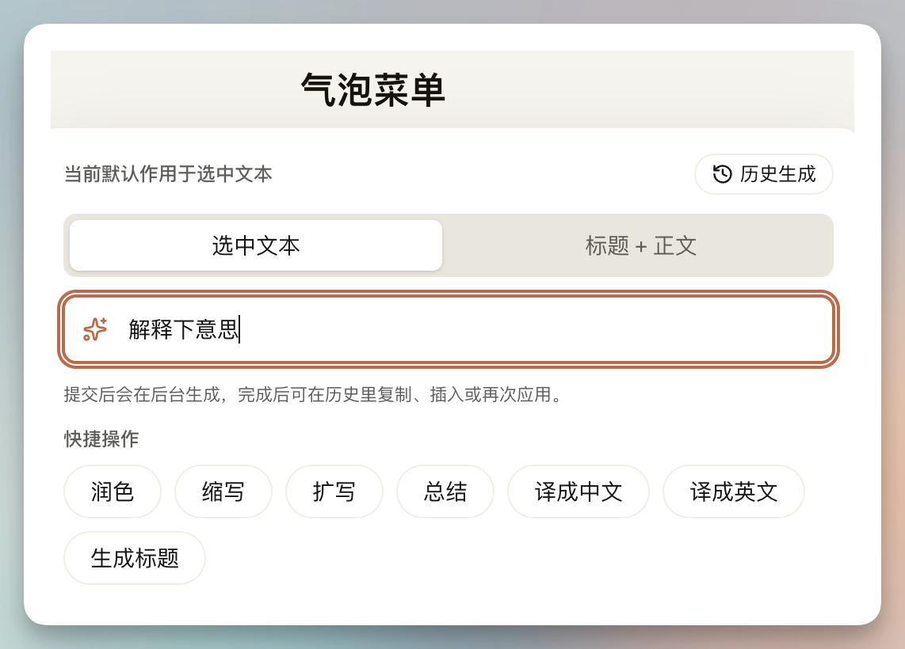
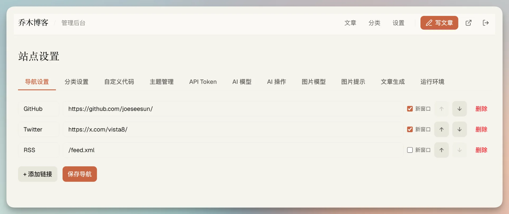
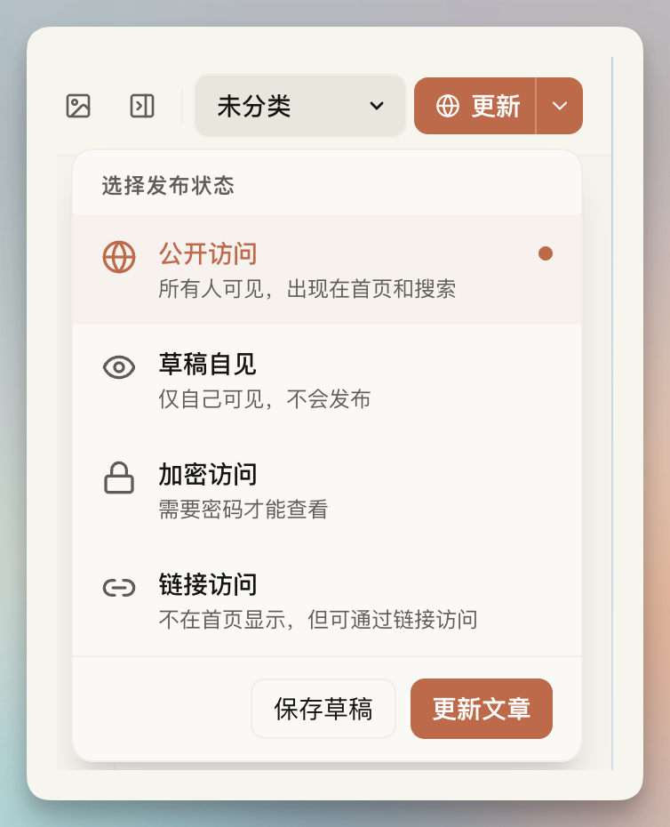
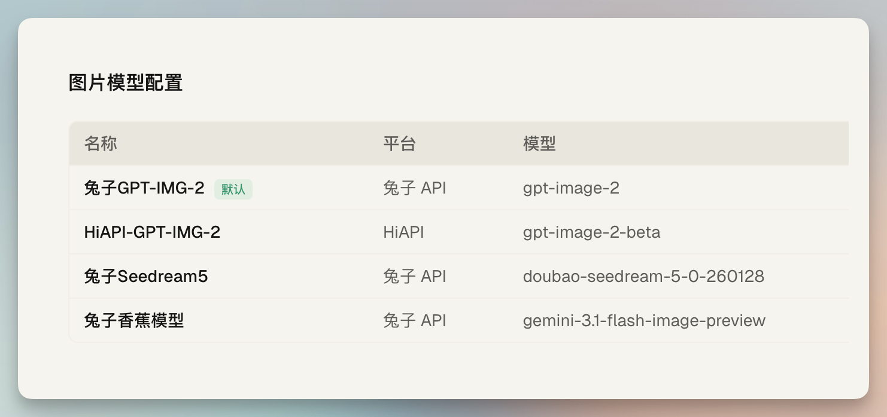

# Qiaomu Blog Open Source

[](https://github.com/joeseesun/qiaomu-blog-opensource/generate)

如果你也想拥有一个真正属于自己的学习、写作、分享阵地，而不是把内容完全寄托在平台算法上，这个项目就是为此做的。

Qiaomu Blog Open Source 不是一个只会渲染 Markdown 的静态模板，而是一套完整的博客系统：前后台双编辑器、AI 写作辅助、AI 生图、主题系统、全文检索、API Token、外部发布生态都已经接好，目标就是让你更容易持续写下去。

- 在线示例：<https://blog.qiaomu.ai/>
- 介绍文章：<https://blog.qiaomu.ai/qiaomu-blog-opensource>
- 当前仓库：<https://github.com/joeseesun/qiaomu-blog-opensource>

## 为什么值得做成自己的站

- 自媒体账号可能被封，平台流量也可能波动，但自己的站点不会
- 写作系统应该足够轻，打开就能写，而不是被后台流程打断
- AI 最该服务的是摘要、标签、封面、slug、生图这些重复工作
- 博客不该只是展示页，还应该是你的长期知识资产

## 你会得到什么

- 前台、后台都能编辑，所见即所得，接近飞书 / Notion 的写作体验
- 四套首页主题，移动端友好，开箱即用
- Bubble Menu + Ask AI，选中文本就能改写、润色、扩写、翻译
- AI 自动处理摘要、标签、SEO slug、封面图
- AI 生图模型和模板配置、最近生成记录、插入和替换工作流
- 图片右键菜单：下载、设为封面、对齐、裁剪、参考生图
- 发布状态：公开、草稿、密码访问、链接访问
- 默认初始化配置：主题、导航、字体、AI 文本模型模板、AI 生图模型模板
- Cloudflare Workers + D1 + R2 部署，不需要自己维护服务器和 CDN

## 截图预览

### 四套首页主题


### 编辑器与所见即所得写作



### Ask AI / Bubble Menu



### 后台设置与主题、代码、API Token 管理



### 多种发布状态



### AI 模型与生图配置



## 配套生态也一起开源了

这个仓库不只开源博客主站，也把外部发布工具一起放进来了。你可以把“写作入口”放在最顺手的地方，但最终都回到同一个博客后台。

- [`ecosystem/chrome-clipper`](ecosystem/chrome-clipper/README.md)：浏览器网页剪藏，直接进入博客草稿箱
- [`ecosystem/obsidian-publisher`](ecosystem/obsidian-publisher/README.md)：从 Obsidian 一键发布到博客
- [`ecosystem/qiaomu-blog-publish-skill`](ecosystem/qiaomu-blog-publish-skill/README.md)：通过 Claude Skill / 命令工作流直接发布
- [`ecosystem/README.md`](ecosystem/README.md)：生态工具总览

## 部署

推荐使用仓库自带的 GitHub Actions。完成一次 Cloudflare 与 GitHub Secrets/Variables 配置后，每次推送 `main` 都会自动在 Linux 环境构建、更新 D1 并发布 Worker。

完整步骤见 [`DEPLOY.md`](DEPLOY.md)。

## 本地开发

本地开发使用 Wrangler 提供的 D1/R2 模拟环境，不会修改远程生产数据。请使用 Node.js 22.5 或更高版本。

```bash
git clone https://github.com/joeseesun/qiaomu-blog-opensource.git
cd qiaomu-blog-opensource
npm install
cp .env.example .env.local
npm run cf:db:local
npm run dev
```

常用入口：

- 首页：`/`
- 后台：`/admin`
- 编辑器：`/editor`

## 默认初始化内容

首次初始化后，模板会自动带上这些基础能力：

- 默认导航
- 默认主题与字体
- 默认分类
- AI 文本模型配置模板
- AI 生图模型配置模板
- 文章摘要、标签、slug、封面生成器
- 编辑器 Ask AI 预设动作

所有 API Key 都不会进入仓库。GitHub 自动部署通过 Repository Secrets 同步 Worker Secrets，资源 ID 和域名通过 Repository Variables 注入临时 CI 配置。

## 技术栈

- Next.js 16
- React 19
- TypeScript
- OpenNext for Cloudflare
- Cloudflare Workers
- Cloudflare D1
- Cloudflare R2
- Novel / Tiptap

## 常用命令

| 命令 | 说明 |
| --- | --- |
| `npm run dev` | Next.js 本地开发 |
| `npm run build` | 构建应用 |
| `npm run verify:quick` | 跑 lint、test、build |
| `npm run verify` | 跑完整验证链路 |
| `npm run cf:db:local` | 初始化本地 D1 模拟数据库 |
| `npm run cf:build` | 构建 OpenNext Worker |
| `npm run cf:dry-run` | 构建并检查 Worker 上传包体 |
| `npm run deploy` | 手动构建并部署到 Cloudflare |

## 作者

- 向阳乔木
- GitHub：<https://github.com/joeseesun>
- X / Twitter：<https://x.com/vista8>
- Blog：<https://blog.qiaomu.ai/>
